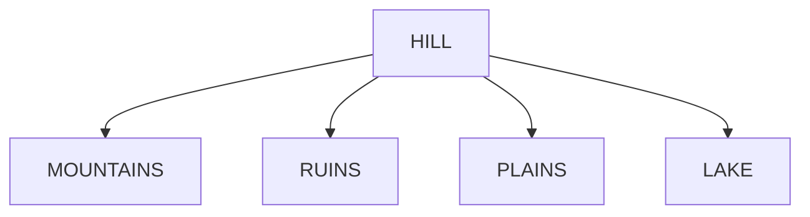

# Starting Point

You wake on a hill, next to a dead husk of a tree, dessicated and shrunken. Thick clouds cover the skies, they tear in places, letting through violet light and covering the world before you in sickly light. Warm wind rolls through your face and air is filled with a sickly sweet smell. When you rise, you have good view of surroundings. To the north, you see a base of massive mountains, it's peaks lost in the clouds.
To your south, a body of water as far as the eye can see, murky water lapping at the stones.
To your east, a vast field of shallow ponds, a weathered road snaking through, yellow haze rising through the air.
To the west, the crumpled walls of the city, ancient stone brought low.

Everywhere you can see, think trunks envelop the surface, burrowing through the city walls and broken stone, razing the ground like veins just under the surface of the skin. Massive trunks are flowing from somewhere across the mountains, scraping the ground to come out seemingly just under the waterfront like giant pipes trailing into the dark.

The terrain in between is littered with dead wood and trails. The layout reminds you of the farming communities outside of waterdeep. If you look closely you can see barren patches that could pass for fields, and cultivated orchards.

@import "plant_people.png"

!!! note This is the admonition title
    This is the admonition body

    C:\Users\Benjamin\Desktop\DnD\ruins.md

    